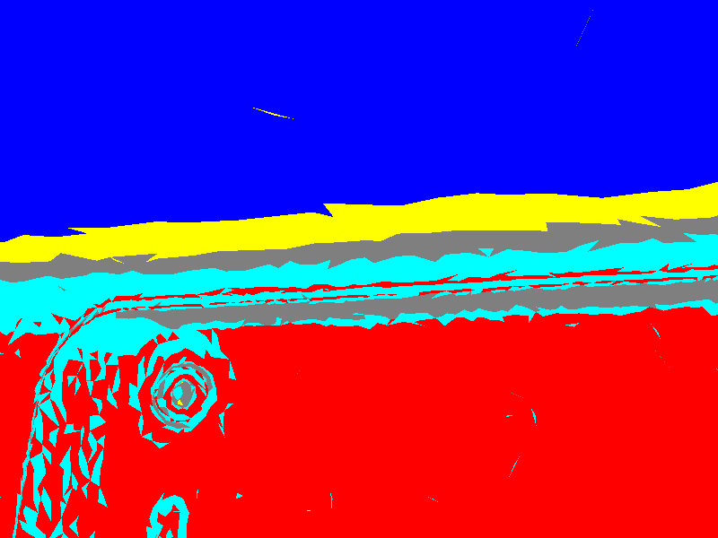

# Huhb3D Synthetic Data Generator (具身智能合成数据生成器)

[](https://www.gnu.org/licenses/agpl-3.0)
[]()
[]()
[]()

> 🤖 **面向机器人视觉训练的合成数据生成器** — 上传 CAD 模型，一键生成多角度 RGB + 语义 Mask + 深度图 + 6DoF 相机位姿

## 🎯 这个项目是什么？

Huhb3D Synthetic Data Generator 是一个**面向具身智能/机器人视觉训练**的合成数据生成工具。你只需上传一个 CAD 模型（STL/STEP/OBJ），系统会自动：

1. 在 360° 不同角度渲染 RGB 图片
2. 生成像素级语义分割 Mask（基于曲率的几何特征识别：螺栓/孔/法兰/凸台）
3. 导出深度图（Depth Map）用于机器人抓取规划
4. 导出 6DoF 相机位姿用于位姿估计训练
5. 转换为 COCO JSON / YOLO 标注格式，可直接用于 Detectron2 / YOLOv8 训练
6. 打包输出为 ZIP

**典型用户**：做机器人视觉的公司/研究者，需要大量"带标注的 3D 数据"来训练 AI 模型。

graph TD
    A[CAD模型: .stl/.obj] --> B[C++ 渲染引擎]
    B --> C{BVH 加速算法}
    C --> D[生成 1000 张 RGB 图像]
    C --> E[生成 1000 张 语义 Mask]
    D & E --> F[打包为 .zip 交付物]

性能项,表现
渲染引擎,C++ OpenGL 4.5
加速技术,BVH (层次包围盒) 零拷贝解析
生成速度,约 0.5秒 / 每对图像 (800x600)
导出格式,RGB PNG + Semantic Mask PNG
    

## 📸 运行效果





## ✨ 核心特性

- **⚡ 零拷贝 STL 解析**：通过内存映射（mmap/VirtualAlloc）与自定义内存池，实现大文件极速加载
- **🔮 PBR 渲染引擎**：基于 OpenGL 3.3+ Core Profile，支持金属度/粗糙度实时调节
- **🌲 BVH 空间加速**：层次包围盒结构，支持视锥体裁剪与微秒级射线拾取
- **🏷️ 几何特征识别**：基于高斯曲率/平均曲率聚类 + 拓扑分析，识别螺栓/孔/法兰/凸台
- **📏 深度图生成**：通过 OpenGL 深度缓冲导出，支持可视化 PNG + 原始 float 数据
- **📐 6DoF 相机位姿**：每帧导出 position / rotation / view_matrix / projection_matrix
- **📋 COCO JSON / YOLO 格式**：一键转换，直接用于主流训练框架
- **🧠 AI 特征描述**（可选）：接入 DeepSeek-V3 大模型，自动生成零件特征描述
- **🌐 Web UI**：基于 Streamlit，浏览器中即可操作，无需命令行

## ⚠️ 当前能力边界

### ✅ 已实现

| 功能 | 说明 |
|------|------|
| 多角度自动拍照 | 360° Fibonacci 球面采样，支持 100-1000 张 |
| 几何特征识别 Mask | 基于曲率聚类 + 拓扑分析，12 类语义标签 |
| 深度图 (Depth Map) | OpenGL 深度缓冲导出，PNG 可视化 + RAW float |
| 6DoF 相机位姿 | camera_poses.json，含 View/Projection 矩阵 |
| COCO JSON / YOLO 格式 | mask_to_coco.py 一键转换 |
| PBR 渲染 | 金属度/粗糙度可调 |
| CAD 格式转换 | STEP/IGES → STL 自动转换（需 cadquery） |
| Web UI | Streamlit 浏览器操作 |
| ZIP 打包输出 | RGB + Mask + Depth + Poses + Legend + Manifest |

### 🏷️ 语义标签分类（基于曲率 + 拓扑分析）

| ID | 类别名 | 含义 | 颜色 (RGB) |
|----|--------|------|------------|
| 0 | FreeSurface | 自由曲面 | 灰色 (127,127,127) |
| 1 | HorizontalPlane | 水平面 | 蓝色 (0,0,255) |
| 2 | LateralPlane_X | 侧平面 X | 绿色 (0,255,0) |
| 3 | LateralPlane_Z | 侧平面 Z | 红色 (255,0,0) |
| 4 | NearHorizontal | 近水平面 | 黄色 (255,255,0) |
| 5 | NearLateral_X | 近侧平面 X | 品红 (255,0,255) |
| 6 | NearLateral_Z | 近侧平面 Z | 青色 (0,255,255) |
| 7 | Degenerate | 退化三角面 | 橙色 (255,127,0) |
| 8 | ConvexFeature_Bolt | 凸起特征（螺栓/螺柱） | 紫色 (127,0,255) |
| 9 | ConcaveFeature_Hole | 凹陷特征（孔洞） | 蓝紫 (0,127,255) |
| 10 | Flange | 法兰特征 | 黄绿 (204,204,0) |
| 11 | Boss | 凸台特征 | 绿色 (0,204,102) |

> ⚠️ 几何特征识别（ID 8-11）基于曲率阈值和规则匹配，对简单几何体效果较好，复杂工业零件可能需要调参。欢迎提 Issue 反馈！

### 🚧 Roadmap（待优化/待实现）

| 功能 | 优先级 | 说明 |
|------|--------|------|
| � 几何特征识别调参优化 | P0 | 针对真实工业零件（螺栓/法兰盘）优化曲率阈值 |
| 🟡 Domain Randomization | P1 | 随机光照/背景/遮挡，提升模型泛化能力 |
| 🟢 实例分割 | P2 | 同类不同实例区分（如多个螺栓分别标注） |
| 🟢 多模型批量生成 | P2 | 数据规模扩展 |
| 🟢 在线部署（Docker + 云服务） | P2 | 一键部署到云端，通过网页访问 |

## 🛠️ 编译与运行指南

### 方式一：一键启动（推荐）

1. 安装 [Miniconda](https://docs.conda.io/en/latest/miniconda.html)（Python 3.8+）
2. 打开命令行，安装依赖：
   ```bash
   pip install streamlit requests Pillow numpy
   ```
3. 编译 C++ 渲染引擎（见下方）
4. 双击 `start_all.bat`，浏览器自动打开

### 方式二：手动启动

```bash
# 启动合成数据生成器 UI
streamlit run app.py --server.port 8501

# 启动 AI Agent 交互界面
streamlit run agent_ui.py --server.port 8502
```

### 编译 C++ 渲染引擎

需要 **Visual Studio 2022**（含 C++ 桌面开发工作负载）和 **CMake >= 3.14**：

```bash
cmake -B build -DCMAKE_BUILD_TYPE=Release
cmake --build build --config Release
```

或使用一键编译脚本：双击 `one_click_run.bat`

### Docker 部署

```bash
docker build -t huhb3d-synthetic .
docker run -p 7860:7860 huhb3d-synthetic
```

访问 `http://localhost:7860` 即可使用。

## 📂 输出数据格式

每次生成会输出一个 ZIP 包，结构如下：

```
run_<timestamp>/
├── rgb/                    # RGB 渲染图片
│   ├── frame_0001.png      # 800×600 PNG
│   └── ...
├── mask/                   # 像素级语义分割 Mask
│   ├── mask_0001.png       # 800×600 PNG（颜色对应类别）
│   └── ...
├── depth/                  # 深度图（可选）
│   ├── depth_0001.png      # 可视化灰度图
│   └── depth_0001.raw      # 原始 float32 数据
├── label_legend.txt        # 类别-颜色映射说明
├── camera_poses.json       # 6DoF 相机位姿
├── description.json        # AI 描述（可选）
└── manifest.json           # 生成元信息
```

### COCO JSON / YOLO 格式转换

```bash
# 生成 COCO JSON
python mask_to_coco.py --input streamlit_output/run_xxxxxxxx

# 同时生成 YOLO 格式
python mask_to_coco.py --input streamlit_output/run_xxxxxxxx --yolo
```

输出：
- `coco_annotations.json` — 可直接用于 Detectron2 / MMDetection
- `yolo_labels/` — 可直接用于 YOLOv8-seg

## 🔧 技术架构

```
┌──────────────────────────────────────────────┐
│              Streamlit Web UI                 │
│  (app.py - 合成数据 / agent_ui.py - AI Agent) │
└──────────────┬───────────────────────────────┘
               │ subprocess
┌──────────────▼───────────────────────────────┐
│         C++ 渲染引擎 (Huhb3DViewer.exe)       │
│  ┌──────────┐ ┌─────┐ ┌──────────────────┐  │
│  │Zero-copy │ │ BVH │ │ PBR Renderer     │  │
│  │STL Parse │ │Accel│ │ (OpenGL 3.3+)     │  │
│  └──────────┘ └─────┘ └──────────────────┘  │
│  ┌──────────────────────────────────────────┐ │
│  │ Curvature → GeoFeature → Semantic Mask  │ │
│  │ (高斯曲率/平均曲率 → 聚类 → 拓扑识别)    │ │
│  └──────────────────────────────────────────┘ │
│  ┌────────────────┐ ┌──────────────────────┐ │
│  │ Depth Map      │ │ Camera Poses (6DoF)  │ │
│  │ (GL_DEPTH_BUF) │ │ (View/Proj Matrix)   │ │
│  └────────────────┘ └──────────────────────┘ │
└──────────────────────────────────────────────┘
               │
┌──────────────▼───────────────────────────────┐
│         Python 后处理 (mask_to_coco.py)       │
│  COCO JSON │ YOLO Labels │ RLE │ Polygons    │
└──────────────────────────────────────────────┘
```

## 📂 测试模型

项目内置了测试模型：
- `Cube.stl` — 立方体
- `Sphere.stl` — 球体

你也可以上传自己的 STL/STEP/OBJ 模型。

## 🤝 适用场景

| 场景 | 是否适用 | 说明 |
|------|---------|------|
| 表面朝向检测训练 | ✅ | 法向量分类直接可用 |
| 几何特征识别训练 | ✅ | 基于曲率的螺栓/孔/法兰/凸台识别 |
| 6DoF 位姿估计训练 | ✅ | 相机位姿标注已导出 |
| 机器人抓取规划 | ✅ | 深度图已导出 |
| 机器人避障 | ✅ | 平面/曲面/侧平面区分 |
| COCO/YOLO 格式训练 | ✅ | mask_to_coco.py 一键转换 |
| Domain Randomization | 🚧 | Roadmap，待实现 |
| 实例分割训练 | 🚧 | Roadmap，待实现 |

## 📄 协议与授权

本项目开源协议为 **AGPL-3.0**。
你可以自由地学习、修改和分发本代码。但如果你使用本项目的代码进行商业闭源软件的开发，你必须同样开源你的整个项目。如需商业闭源授权，请通过开发者联系方式沟通。

---
*Developed by Huhb - 致力于探索图形学与工业软件的极限性能。*
