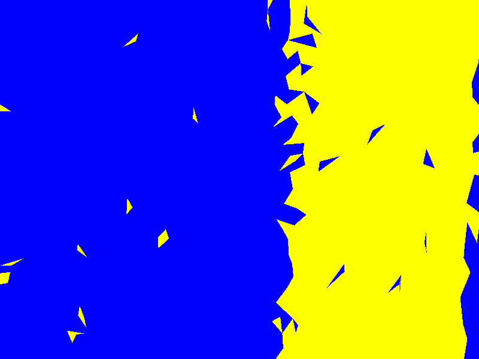

# Huhb3D Synthetic Data Generator (机器人视觉合成数据生成器)

[](https://www.gnu.org/licenses/agpl-3.0)
[]()
[]()
[]()
[]()

> 🤖 **面向机器人视觉训练的合成数据生成器** — 上传 CAD 模型，生成 RGB + 语义Mask + 深度图 + 6DoF位姿 + BOP/COCO/YOLO标注

**[🌐 在线 Demo](https://huggingface.co/spaces/Hgodwarrior/Huhb3D-Synthetic-Data-Generator)** | **[📄 效果展示页](demo_showcase.html)** | **[🚀 快速开始](#-快速开始)** | **[💰 商业授权](#-许可证与定价)**

---

## ⚠️ 重要说明

> **完整数据生成功能需要编译 C++ 渲染引擎**。未编译时，项目以 Demo 模式运行，仅可查看预生成的样例数据。
> - 编译需要：Visual Studio 2019+（含 C++ 桌面开发工具）+ CMake 3.16+
> - STEP 拓扑解析需要：cadquery（~500MB，含 OpenCASCADE）
> - 最简单的部署方式：**Docker**（自动编译 C++ 引擎）

---

## 🎯 这个项目是什么？

Huhb3D Synthetic Data Generator 是一个面向**具身智能/机器人视觉训练**的合成数据生成工具。

**核心价值**：从 STEP 文件精确提取拓扑 Ground Truth，生成机器人视觉训练所需的全链路标注数据。

```
CAD模型 (.step/.stl) → [5步Pipeline] → 可训练数据集 (BOP/COCO/YOLO)
```

### 与竞品的核心差异

| 能力 | Huhb3D | BlenderProc | NVIDIA Isaac Sim |
|------|--------|-------------|------------------|
| STEP拓扑Ground Truth | ✅ 原生 | ❌ | ❌ |
| 一键Web UI | ✅ | ❌ | ❌ |
| CPU即可渲染 | ✅ | ❌ 需GPU(Blender) | ❌ 需高端GPU |
| 渲染质量 | 🟡 基础PBR | 🟢 高(Cycles) | 🟢 高(RTX) |
| 物理仿真 | ❌ | ⚠️ 有限 | ✅ 完整 |
| BOP格式输出 | ✅ | ✅ | ⚠️ |
| 批量Pipeline | ✅ | ⚠️ | ✅ |
| 质量报告 | ✅ | ❌ | ⚠️ |

---

## ✨ 核心特性

### 📐 STEP 拓扑解析（核心差异化能力）

基于 OpenCASCADE 精确解析 STEP 文件拓扑结构，生成**像素级 Ground Truth 标签**：

| 面类型 | Feature ID | 含义 | 典型应用 |
|--------|-----------|------|----------|
| PLANE | 1 | 平面 | 装配面检测、平面抓取 |
| CYLINDER | 2 | 圆柱面 | 轴孔配合、圆柱抓取 |
| CONE | 3 | 圆锥面 | 锥度检测、定位销 |
| SPHERE | 4 | 球面 | 球关节检测 |
| TORUS | 5 | 环面 | 密封槽、O型圈槽 |

> 💡 传统方法用高斯曲率估算面类型，精度有限。我们直接从 STEP B-Rep 拓扑提取面类型（PLANE/CYLINDER等），**拓扑类型提取准确**。但孔/螺栓等语义分类依赖启发式规则（半径/面积比），对复杂零件可能需调参。

### 🎯 6DoF Ground Truth

每帧输出精确的相机位姿，BOP 格式标准输出：
- `scene_camera.json` — 相机内参 (cam_K)
- `scene_gt.json` — 6DoF 位姿 (旋转矩阵 + 平移向量 + 四元数)
- `gt_6dof.json` — 完整位姿数据

### 🎨 Instance Segmentation

RGB Mask 编码 `(R=InstanceID, G=FeatureTypeID, B=FeatureIndex)`，支持同类多实例区分。

### � Sim-to-Real 增强

| 增强方法 | 参数 | 作用 |
|----------|------|------|
| 高斯噪声 | sigma 5-25 | 模拟传感器噪声 |
| 运动模糊 | 角度0-15°, 核3-15 | 模拟运动相机 |
| 随机遮挡 | 20%概率, 面积5-25% | 模拟部分遮挡 |
| 色彩抖动 | 亮度/对比度/饱和度 | 提升色彩鲁棒性 |
| 深度噪声 | sigma 2-8mm | 模拟深度传感器误差 |

### 📏 线性深度图

OpenGL NDC → 线性深度转换，uint16 编码，支持 mm/m/cm/inch 单位。

### 🎲 Domain Randomization

随机光照 / 相机抖动 / 背景替换，大幅提升训练数据多样性。

### 📊 数据质量报告

自动生成 JSON + HTML 格式的质量报告，含训练就绪度评分（0-100分），可交付客户。

### 🔄 批量 Pipeline

一键处理整个 STEP 文件目录：拓扑 → 渲染 → 增强 → 标注 → 报告，全流程自动化。

---

## 🖼️ 效果展示

### 渲染效果


### 合成数据生成


### 数据输出样例

| RGB 渲染图 | 语义分割 Mask | 实例分割 Mask |
|:---:|:---:|:---:|
|  |  | Instance ID + Feature Type 编码 |

### BOP 格式输出

```json
// scene_camera.json
{
  "1": {
    "cam_K": [800.0, 0.0, 400.0, 0.0, 800.0, 300.0, 0.0, 0.0, 1.0],
    "depth_scale": 1.0
  }
}

// scene_gt.json
{
  "1": [{
    "obj_id": 1,
    "cam_R_m2c": [[1,0,0],[0,1,0],[0,0,1]],
    "cam_t_m2c": [0, 0, 5000],
    "cam_R_t_m2c": [1.0, 0.0, 0.0, 0.0]
  }]
}
```

---

## 🚀 快速开始

### 前置条件

| 组件 | 必须？ | 说明 |
|------|--------|------|
| Python 3.8+ | ✅ 必须 | 推荐 Miniconda |
| streamlit, Pillow, numpy, opencv-python | ✅ 必须 | `pip install streamlit Pillow numpy opencv-python` |
| C++ 渲染引擎 (test_render.exe) | ⚠️ 生成数据必须 | 未编译 = 只能看 Demo |
| Visual Studio 2019+ (C++ 桌面开发) | ⚠️ 编译引擎需要 | 含 CMake |
| cadquery (~500MB) | ⚠️ STEP 拓扑需要 | 含 OpenCASCADE |

### 方式一：一键启动（查看 Demo）

**Windows 用户：**

1. 安装 [Miniconda](https://docs.conda.io/en/latest/miniconda.html)（Python 3.8+）
2. **双击 `start_demo.bat`**，自动安装依赖并打开浏览器

> ⚠️ 未编译 C++ 引擎时，自动进入 Demo 模式，仅可查看预生成的样例数据（6张RGB + 6张Mask + BOP格式 + 6DoF位姿）。**无法生成新数据。**

### 方式二：编译 C++ 引擎（解锁完整功能）

1. 安装 [Visual Studio 2022 Community](https://visualstudio.microsoft.com/downloads/)（勾选"使用C++的桌面开发"）
2. 安装 [CMake](https://cmake.org/download/) >= 3.16
3. **双击 `build_and_compile.bat`**，自动检测 VS 并编译
4. 编译成功后重新运行 `start_demo.bat`

> 编译成功后，Web UI 自动检测到 `test_render.exe`，可上传自己的 CAD 模型生成数据。

### 方式三：Docker 部署（推荐服务器/云端，最省心）

```bash
docker build -t huhb3d-synthetic .
docker run -p 7860:7860 huhb3d-synthetic
# 访问 http://localhost:7860
```

> Docker 镜像自动编译 C++ 引擎，开箱即用。

### 方式四：手动启动

```bash
pip install -r requirements.txt
streamlit run app.py --server.port 8501
```

---

## 📖 使用指南

### Web UI 操作流程

1. **上传模型**：拖拽或点击上传 STL/STEP/OBJ 文件
2. **设置参数**：
   - 生成图片数量（100-50000，取决于许可证）
   - 图片分辨率（默认 800×600）
   - 相机半径（默认 5.0）
   - 模型单位（mm/m/cm/inch）
3. **选择功能**：
   - ✅ 语义分割 Mask
   - ✅ 实例分割 Mask
   - ✅ 深度图
   - ✅ STEP 拓扑解析
   - ✅ Sim-to-Real 增强
   - ✅ 光照随机化
   - ✅ 相机抖动
   - ✅ 背景随机化
4. **点击生成**：点击 "🚀 Start Generation"
5. **查看结果**：在线预览 RGB/Mask/深度图
6. **下载数据**：一键打包 ZIP 下载

### 命令行批量处理

```bash
# 批量处理整个目录的 STEP 文件
python batch_pipeline.py \
    --input-dir ./step_files \
    --output-dir ./dataset \
    --samples 500 \
    --topology \
    --sim2real \
    --report

# 仅渲染（不增强）
python batch_pipeline.py \
    --input-dir ./models \
    --output-dir ./output \
    --samples 1000 \
    --depth \
    --light-randomization \
    --camera-jitter
```

### 标注格式转换

```bash
# COCO 语义分割
python mask_to_coco.py --input ./output/run_xxx

# COCO 实例分割
python mask_to_coco.py --input ./output/run_xxx --instance

# YOLO 检测格式
python mask_to_coco.py --input ./output/run_xxx --yolo

# YOLO 分割格式
python mask_to_coco.py --input ./output/run_xxx --yolo-seg
```

### 数据质量报告

```bash
# JSON 格式报告
python dataset_report.py --input ./output/run_xxx

# HTML 格式报告（可交付客户）
python dataset_report.py --input ./output/run_xxx --format html
```

### 许可证管理

```bash
# 查看当前机器 ID
python license_guard.py

# 生成许可证文件
python license_guard.py --generate --tier professional --licensed-to "客户名" --expires 2026-12-31

# 验证许可证
python license_guard.py --check huhb3d.license
```

---

## 📂 输出数据格式

每次生成输出完整数据集，结构如下：

```
run_<timestamp>/
├── rgb/                        # RGB 渲染图片
│   ├── frame_0001.png          # 800×600 PNG
│   └── ...
├── mask/                       # 语义分割 Mask
│   ├── mask_0001.png           # 颜色编码 = 类别
│   └── ...
├── mask_instance/              # 实例分割 Mask
│   ├── instance_0001.png       # R=InstanceID, G=FeatureType, B=Index
│   └── ...
├── depth/                      # 深度图
│   ├── depth_0001.png          # uint16 线性深度 (mm)
│   └── ...
├── scene_camera.json           # BOP 相机内参
├── scene_gt.json               # BOP 6DoF Ground Truth
├── gt_6dof.json                # 完整 6DoF 位姿数据
├── camera_poses.json           # 相机位姿 (View/Proj Matrix)
├── coco_annotations.json       # COCO 格式标注
├── coco_instance_annotations.json  # COCO 实例标注
├── yolo_labels/                # YOLO 格式标注
├── yolo_instance_labels/       # YOLO 实例标注
├── data.yaml                   # YOLO 训练配置
├── dataset_report.json         # 数据质量报告
├── dataset_report.html         # 可视化质量报告
├── topology_labels.json        # STEP 拓扑 Ground Truth
├── topology_summary.json       # 拓扑统计摘要
├── label_legend.txt            # 标签-颜色映射
└── manifest.json               # 生成元信息
```

---

## 🔧 技术架构

```
┌──────────────────────────────────────────────────────────────┐
│                    Streamlit Web UI (app.py)                  │
│  ┌──────────────┐ ┌──────────────┐ ┌──────────────────────┐ │
│  │ License Guard│ │ STEP Topology│ │ Quality Report Engine│ │
│  └──────────────┘ └──────────────┘ └──────────────────────┘ │
└──────────────────────────┬───────────────────────────────────┘
                           │ subprocess
┌──────────────────────────▼───────────────────────────────────┐
│              C++ 渲染引擎 (test_render.exe)                    │
│  ┌──────────┐ ┌─────┐ ┌──────────────────────────────────┐  │
│  │Zero-copy │ │ BVH │ │ PBR Renderer (OpenGL 3.3+)       │  │
│  │STL Parse │ │Accel│ │ + Instance Segmentation           │  │
│  └──────────┘ └─────┘ │ + Linear Depth (uint16 mm)        │  │
│                         │ + BOP Format Output               │  │
│  ┌─────────────────────┴──────────────────────────────────┐ │
│  │ STEP Topology → Ground Truth Labels                    │ │
│  │ (PLANE/CYLINDER/CONE/SPHERE/TORUS → Pixel-level Mask) │ │
│  └────────────────────────────────────────────────────────┘ │
│  ┌────────────────┐ ┌──────────────────────────────────────┐│
│  │ Domain Random  │ │ 6DoF Camera Poses                   ││
│  │ (Light/Jitter/ │ │ (View Matrix + Projection Matrix    ││
│  │  Background)   │ │  + Quaternion + Translation)        ││
│  └────────────────┘ └──────────────────────────────────────┘│
└──────────────────────────────────────────────────────────────┘
                           │
┌──────────────────────────▼───────────────────────────────────┐
│              Python 后处理 Pipeline                            │
│  ┌──────────────┐ ┌──────────────┐ ┌──────────────────────┐ │
│  │ sim_to_real  │ │ mask_to_coco │ │ dataset_report       │ │
│  │ (Gaussian/   │ │ (COCO/YOLO/  │ │ (Quality Score +     │ │
│  │  Blur/Occl/  │ │  YOLO-seg/   │ │  Training Readiness  │ │
│  │  Jitter)     │ │  Instance)   │ │  Assessment)         │ │
│  └──────────────┘ └──────────────┘ └──────────────────────┘ │
│  ┌──────────────────────────────────────────────────────────┐│
│  │ batch_pipeline.py (End-to-End Automation)                ││
│  └──────────────────────────────────────────────────────────┘│
└──────────────────────────────────────────────────────────────┘
```

---

## 📂 项目文件说明

| 文件 | 说明 |
|------|------|
| `app.py` | Streamlit Web UI 主程序 |
| `start_demo.bat` | 一键启动脚本（Windows） |
| `demo_showcase.html` | 效果展示页面（可发给客户） |
| `step_topology_parser.py` | STEP 拓扑解析（OpenCASCADE） |
| `sim_to_real.py` | Sim-to-Real 数据增强 |
| `mask_to_coco.py` | COCO/YOLO 标注格式转换 |
| `batch_pipeline.py` | 批量处理 Pipeline |
| `dataset_report.py` | 数据质量报告生成 |
| `license_guard.py` | 许可证保护系统 |
| `src/render/render_manager.cpp` | C++ 渲染引擎核心 |
| `src/render/render_manager.h` | 渲染配置结构体 |
| `src/render/test_render.cpp` | C++ CLI 入口 |
| `CMakeLists.txt` | CMake 构建配置 |
| `Dockerfile` | Docker 容器配置 |
| `requirements.txt` | Python 依赖 |

---

## 💰 许可证与定价

| 层级 | 年价 | 图片/会话 | STEP拓扑 | Sim-to-Real | 批量Pipeline | BOP格式 |
|------|------|----------|---------|-------------|-------------|---------|
| **Free** | 免费 | 100 | ❌ | ❌ | ❌ | ❌ |
| **Standard** | ¥2,999 | 5,000 | ✅ | ✅ | ❌ | ✅ |
| **Professional** | ¥9,999 | 50,000 | ✅ | ✅ | ✅ | ✅ |
| **Enterprise** | ¥29,999 | 无限 | ✅ | ✅ | ✅ | ✅ |

- Free 版永久免费，适合学术研究
- Standard 版适合中小 AI 团队
- Professional 版适合机器人视觉公司（推荐）
- Enterprise 版含私有部署 + 优先支持 + SLA

商业闭源授权请联系开发者。

---

## 🤝 适用场景

| 场景 | 适用性 | 说明 |
|------|--------|------|
| 6DoF 位姿估计训练 | ✅✅✅ | BOP 格式标准输出 |
| 几何特征检测训练 | ✅✅✅ | STEP 拓扑 Ground Truth |
| 机器人抓取规划 | ✅✅✅ | 线性深度图 + 语义分割 |
| 工业质检 | ✅✅ | Sim-to-Real 增强泛化 |
| AI 训练数据服务 | ✅✅ | 批量 Pipeline 规模化 |
| 学术研究 | ✅ | Free 版即可论文实验 |

---

## 🛠️ 编译与部署

### Windows 编译

```bash
# 前置条件：Visual Studio 2022 + CMake >= 3.16
cmake -B build -DCMAKE_BUILD_TYPE=Release
cmake --build build --config Release
```

### Linux 编译

```bash
sudo apt install build-essential cmake libgl1-mesa-dev libglfw3-dev
cmake -B build -DCMAKE_BUILD_TYPE=Release
make -C build -j$(nproc)
```

### Docker 部署

```bash
docker build -t huhb3d-synthetic .
docker run -p 7860:7860 huhb3d-synthetic
```

---

## 📄 协议与授权

本项目开源协议为 **AGPL-3.0**。

你可以自由地学习、修改和分发本代码。但如果你使用本项目的代码进行商业闭源软件的开发，你必须同样开源你的整个项目。如需商业闭源授权，请通过开发者联系方式沟通。

---

*Developed by Huhb — 致力于探索图形学与工业软件的极限性能。*
*专注机器人视觉合成数据生成，不与 CAD 巨头竞争。*
