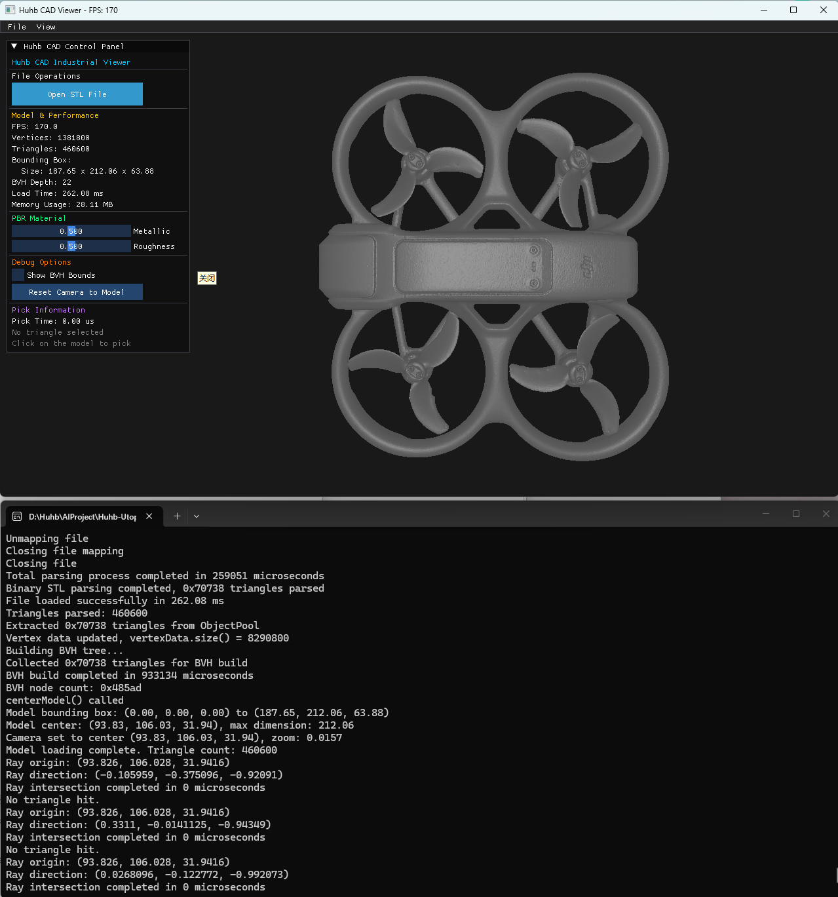
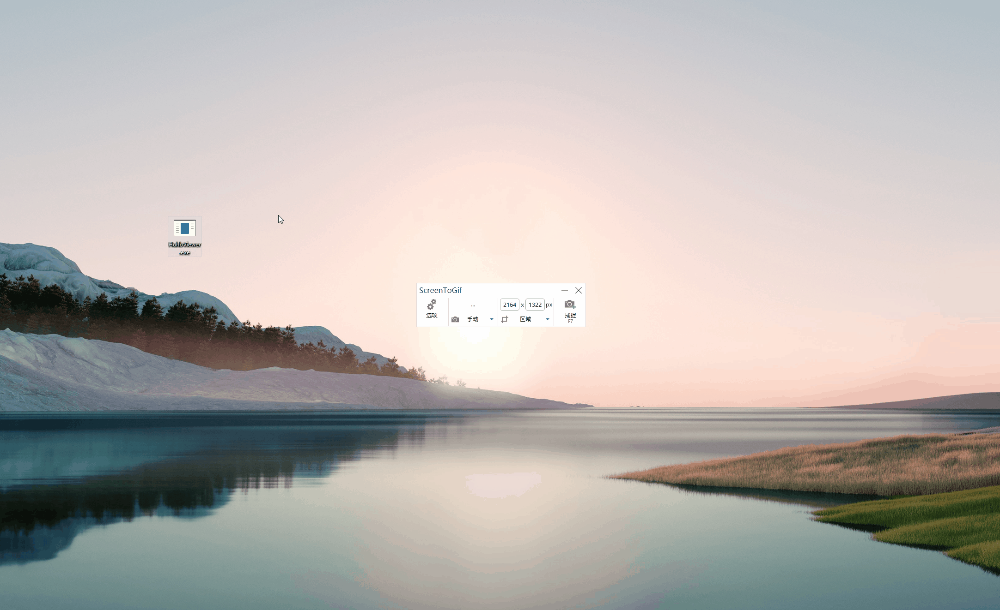
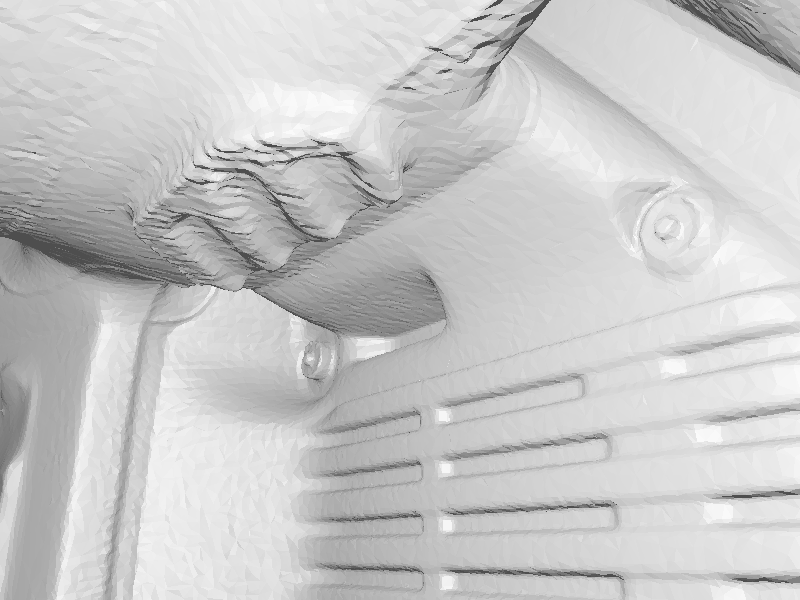

# Huhb3D Synthetic Data Generator (具身智能合成数据生成器)

[](https://www.gnu.org/licenses/agpl-3.0)
[]()
[]()
[]()

> 🤖 **面向机器人视觉训练的合成数据生成器** — 上传 CAD 模型，一键生成多角度 RGB 图片 + 像素级语义分割 Mask

## 🎯 这个项目是什么？

Huhb3D Synthetic Data Generator 是一个**面向具身智能/机器人视觉训练**的合成数据生成工具。你只需上传一个 CAD 模型（STL/STEP/OBJ），系统会自动：

1. 在 360° 不同角度渲染 RGB 图片
2. 生成对应的像素级语义分割 Mask（按表面朝向分类）
3. 打包输出为 ZIP（含 RGB + Mask + 标签说明）

**典型用户**：做机器人视觉的公司/研究者，需要大量"带标注的 3D 数据"来训练 AI 模型。

graph TD
    A[CAD模型: .stl/.obj] --> B[C++ 渲染引擎]
    B --> C{BVH 加速算法}
    C --> D[生成 1000 张 RGB 图像]
    C --> E[生成 1000 张 语义 Mask]
    D & E --> F[打包为 .zip 交付物]
    

## 📸 运行效果








## ✨ 核心特性

- **⚡ 零拷贝 STL 解析**：通过内存映射（mmap/VirtualAlloc）与自定义内存池，实现大文件极速加载
- **🔮 PBR 渲染引擎**：基于 OpenGL 3.3+ Core Profile，支持金属度/粗糙度实时调节
- **🌲 BVH 空间加速**：层次包围盒结构，支持视锥体裁剪与微秒级射线拾取
- **🏷️ 像素级语义 Mask**：每个三角面按法向量方向自动分类并着色导出
- **🧠 AI 特征描述**（可选）：接入 DeepSeek-V3 大模型，自动生成零件特征描述
- **🌐 Web UI**：基于 Streamlit，浏览器中即可操作，无需命令行

## ⚠️ 当前能力边界（请务必阅读）

### ✅ 已实现

| 功能 | 说明 |
|------|------|
| 多角度自动拍照 | 360° 环绕，支持自定义采样数量（100-1000） |
| 像素级语义 Mask | 按三角面法向量方向分类着色 |
| PBR 渲染 | 金属度/粗糙度可调 |
| CAD 格式转换 | STEP/IGES → STL 自动转换（需 cadquery） |
| Web UI | Streamlit 浏览器操作 |
| ZIP 打包输出 | RGB + Mask + label_legend.txt |

### 🏷️ 当前语义标签分类（基于法向量方向）

当前 Mask 的语义标签是基于**三角面法向量方向**分类的，共 10 个类别：

| ID | 类别名 | 含义 | 颜色 (RGB) |
|----|--------|------|------------|
| 0 | FreeSurface | 自由曲面（法向量无明确朝向） | 灰色 (127,127,127) |
| 1 | HorizontalPlane | 水平面（法向量朝 Y 轴） | 蓝色 (0,0,255) |
| 2 | LateralPlane_X | 侧平面 X（法向量朝 X 轴） | 绿色 (0,255,0) |
| 3 | LateralPlane_Z | 侧平面 Z（法向量朝 Z 轴） | 红色 (255,0,0) |
| 4 | NearHorizontal | 近水平面 | 黄色 (255,255,0) |
| 5 | NearLateral_X | 近侧平面 X | 品红 (255,0,255) |
| 6 | NearLateral_Z | 近侧平面 Z | 青色 (0,255,255) |
| 7 | Degenerate | 退化三角面 | 橙色 (255,127,0) |

**适用场景**：表面朝向检测、方向识别、法向量分布分析、机器人避障中的表面类型判断。

**不适用场景**：需要识别"螺栓""螺孔""法兰"等功能特征的场景（见下方 Roadmap）。

### 🚧 未实现（Roadmap）

| 功能 | 优先级 | 说明 |
|------|--------|------|
| 🔴 几何特征识别（螺栓/孔/法兰/凸台/凹槽） | P0 | 核心壁垒，基于曲率分析 + 拓扑识别 |
| 🔴 COCO JSON / YOLO 标注格式输出 | P0 | 训练框架必需的标准格式 |
| 🔴 相机位姿标注（每帧 extrinsics） | P0 | 6DoF 位姿估计训练必需 |
| 🟡 深度图（Depth Map）保存 | P1 | 机器人抓取规划必需 |
| 🟡 Domain Randomization（随机光照/背景/遮挡） | P1 | 提升模型泛化能力 |
| 🟢 实例分割（同类不同实例区分） | P2 | 精细抓取任务 |
| 🟢 多模型批量生成 | P2 | 数据规模扩展 |

## 🛠️ 编译与运行指南

### 方式一：一键启动（推荐）

1. 安装 [Miniconda](https://docs.conda.io/en/latest/miniconda.html)（Python 3.8+）
2. 打开命令行，安装依赖：
   ```bash
   pip install streamlit requests
   ```
3. 编译 C++ 渲染引擎（见下方）
4. 双击 `start_all.bat`，浏览器自动打开

### 方式二：手动启动

```bash
# 启动合成数据生成器 UI
streamlit run app.py --server.port 8501

# 启动 AI Agent 交互界面
streamlit run agent_ui.py --server.port 8502
```

### 编译 C++ 渲染引擎

需要 **Visual Studio 2022**（含 C++ 桌面开发工作负载）和 **CMake >= 3.14**：

```bash
cmake -B build -DCMAKE_BUILD_TYPE=Release
cmake --build build --config Release
```

或使用一键编译脚本：双击 `one_click_run.bat`

### Docker 部署

```bash
docker build -t huhb3d-synthetic .
docker run -p 7860:7860 huhb3d-synthetic
```

访问 `http://localhost:7860` 即可使用。

## 📂 输出数据格式

每次生成会输出一个 ZIP 包，结构如下：

```
run_<timestamp>/
├── rgb/                    # RGB 渲染图片
│   ├── frame_0001.png      # 800×600 PNG
│   ├── frame_0002.png
│   └── ...
├── mask/                   # 像素级语义分割 Mask
│   ├── mask_0001.png       # 800×600 PNG（颜色对应类别）
│   ├── mask_0002.png
│   └── ...
├── label_legend.txt        # 类别-颜色映射说明
└── manifest.json           # 生成元信息
```

## 🔧 技术架构

```
┌─────────────────────────────────────────┐
│           Streamlit Web UI              │
│  (app.py - 合成数据 / agent_ui.py - AI) │
└──────────────┬──────────────────────────┘
               │ subprocess / HTTP
┌──────────────▼──────────────────────────┐
│        C++ 渲染引擎 (test_render.exe)    │
│  ┌─────────┐ ┌─────┐ ┌──────────────┐  │
│  │Zero-copy│ │ BVH │ │ PBR Renderer │  │
│  │STL Parse│ │Accel│ │ (OpenGL 3.3+) │  │
│  └─────────┘ └─────┘ └──────────────┘  │
│  ┌─────────────────────────────────────┐ │
│  │  Semantic Label (法向量分类 → Mask) │ │
│  └─────────────────────────────────────┘ │
└─────────────────────────────────────────┘
```

## 📂 测试模型

项目内置了 3 个测试模型：
- `Cube.stl` — 立方体
- `Sphere.stl` — 球体
- `Dji+Avata+2+Simple.stl` — 大疆无人机（46 万面片）

你也可以上传自己的 STL/STEP/OBJ 模型。

## 🤝 适用场景

| 场景 | 是否适用 | 说明 |
|------|---------|------|
| 表面朝向检测训练 | ✅ | 法向量分类直接可用 |
| 法向量分布分析 | ✅ | 10 类法向量标签 |
| 机器人避障（表面类型判断） | ✅ | 平面/曲面/侧平面区分 |
| 螺栓/孔/法兰识别训练 | ❌（Roadmap） | 需要几何特征识别，尚未实现 |
| 6DoF 位姿估计训练 | ❌（Roadmap） | 需要相机位姿标注，尚未实现 |
| 实例分割训练 | ❌（Roadmap） | 需要实例级标注，尚未实现 |

## 📄 协议与授权

本项目开源协议为 **AGPL-3.0**。
你可以自由地学习、修改和分发本代码。但如果你使用本项目的代码进行商业闭源软件的开发，你必须同样开源你的整个项目。如需商业闭源授权，请通过开发者联系方式沟通。

---
*Developed by Huhb - 致力于探索图形学与工业软件的极限性能。*
